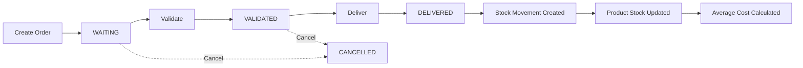

# Tricol - Supplier Order Management System

> A comprehensive supplier order management system with automatic stock tracking and valuation for professional clothing manufacturing.

[](https://spring.io/projects/spring-boot)
[](https://www.oracle.com/java/)
[](https://www.postgresql.org/)
[](LICENSE)

---

## Table of Contents

- [Overview](#-overview)
- [Core Features](#-core-features)
- [Technologies](#-technologies)
- [Architecture](#-architecture)
- [Getting Started](#-getting-started)
- [API Documentation](#-api-documentation)
- [Testing Strategy](#-testing-strategy)
- [Running Tests](#-running-tests)
- [Test Coverage](#-test-coverage)
- [Project Structure](#-project-structure)
- [Configuration](#-configuration)
- [Contributing](#-contributing)

---

## Overview

**Tricol Supplier Order Management** is an enterprise-grade application designed for managing supplier relationships, product inventory, purchase orders, and stock movements with automatic valuation using FIFO or CUMP methods.

### Key Highlights

- ✅ **Automatic Stock Management** - Stock movements created automatically when orders are delivered
- ✅ **Flexible Valuation** - Support for both FIFO (First In, First Out) and CUMP (Weighted Average Cost) methods
- ✅ **Complete Order Lifecycle** - From creation to delivery with status validation
- ✅ **RESTful API** - Clean, well-documented REST endpoints
- ✅ **Hexagonal Architecture** - Clean, maintainable, and testable code structure
- ✅ **Production Ready** - Comprehensive error handling, validation, and logging

---

## Core Features

### 1. **Supplier Management**
- Create, read, update, and delete suppliers
- Track supplier information (company, contact, ICE, address)
- Pagination and filtering support
- Validation for all required fields

### 2. **Product Management**
- Complete product catalog management
- Stock quantity tracking
- Average cost calculation (FIFO/CUMP)
- Category-based organization
- Search by name, filter by category or supplier
- Low stock alerts

### 3. **Order Management**
- Create purchase orders with multiple items
- Automatic total amount calculation
- Order status workflow: `WAITING` → `VALIDATED` → `DELIVERED` → `CANCELLED`
- Status transition validation
- Order history tracking

### 4. **Stock Movement Management**
- **Automatic stock movements** when orders are delivered
- Manual stock movement creation (ENTRY, EXIT, ADJUSTMENT)
- Complete movement history
- Real-time stock quantity updates
- Automatic average cost calculation

### 5. **Stock Valuation**
- **FIFO (First In, First Out)**: Tracks remaining quantity per entry, uses oldest stock first
- **CUMP (Coût Unitaire Moyen Pondéré)**: Calculates weighted average cost on each entry
- Configurable via `application.properties`
- Accurate cost tracking for financial reporting

### 6. **Additional Features**
- Pagination on all list endpoints
- Input validation with meaningful error messages
- Global exception handling
- Swagger/OpenAPI documentation
- Database migrations with Liquibase
- Transaction management

---

## Technologies

### Backend Framework
- **Spring Boot 3.5.7** - Application framework
- **Spring Data JPA** - Data persistence layer
- **Spring Web** - REST API development
- **Spring Validation** - Input validation

### Database
- **PostgreSQL** - Primary database
- **Liquibase** - Database version control and migrations

### Mapping & Code Generation
- **MapStruct 1.6.3** - DTO to Entity mapping
- **Lombok 1.18.32** - Boilerplate code reduction

### Documentation
- **Swagger/OpenAPI 2.8.8** - Interactive API documentation
- **Mermaid** - Architecture diagrams

### Build Tool
- **Maven** - Dependency management and build automation

---

## Architecture

### Hexagonal Architecture (Ports & Adapters)

This project follows **Hexagonal Architecture** principles, also known as **Ports and Adapters** pattern, combined with **Domain-Driven Design (DDD)**.

```
┌────────────────────────────────────────────────────────┐
│                     API Layer                          │
│  ┌──────────────┐  ┌──────────────┐  ┌──────────────┐  │
│  │ Controllers  │  │     DTOs     │  │   Mappers    │  │
│  │  (REST API)  │  │  (Requests/  │  │ (MapStruct)  │  │
│  │              │  │  Responses)  │  │              │  │
│  └──────────────┘  └──────────────┘  └──────────────┘  │
└────────────────────────────────────────────────────────┘
                           ↓
┌─────────────────────────────────────────────────────────┐
│                  Application Layer                      │
│  ┌──────────────┐  ┌──────────────┐                     │
│  │   Services   │  │    Ports     │                     │
│  │  (Business   │  │ (Interfaces) │                     │
│  │    Logic)    │  │              │                     │
│  └──────────────┘  └──────────────┘                     │
└─────────────────────────────────────────────────────────┘
                           ↓
┌─────────────────────────────────────────────────────────┐
│                    Domain Layer                         │
│  ┌──────────────┐  ┌──────────────┐  ┌──────────────┐   │
│  │    Models    │  │    Enums     │  │  Exceptions  │   │
│  │   (Pure      │  │              │  │              │   │
│  │   Domain)    │  │              │  │              │   │
│  └──────────────┘  └──────────────┘  └──────────────┘   │
└─────────────────────────────────────────────────────────┘
                           ↓
┌────────────────────────────────────────────────────────┐
│                Infrastructure Layer                    │
│  ┌──────────────┐  ┌──────────────┐  ┌──────────────┐  │
│  │  Adapters    │  │ JPA Entities │  │ Repositories │  │
│  │              │  │              │  │              │  │
│  └──────────────┘  └──────────────┘  └──────────────┘  │
└────────────────────────────────────────────────────────┘
                           ↓
                    ┌──────────────┐
                    │  PostgreSQL  │
                    └──────────────┘
```

### Why Hexagonal Architecture?

1. **Separation of Concerns** - Clear boundaries between layers
2. **Testability** - Easy to test business logic in isolation
3. **Flexibility** - Easy to swap implementations (e.g., change database)
4. **Maintainability** - Changes in one layer don't affect others
5. **Domain-Centric** - Business logic is independent of frameworks

### Module Structure

Each module (Supplier, Product, Order, Stock) follows the same structure:

```
module/
├── api/
│   ├── controller/     # REST endpoints
│   ├── dto/            # Request/Response DTOs
│   └── mapper/         # MapStruct mappers
├── application/
│   ├── service/        # Business logic
│   └── ports/          # Service interfaces
├── domain/
│   ├── model/          # Domain entities
│   ├── enums/          # Domain enumerations
│   ├── exception/      # Domain exceptions
│   └── ports/          # Repository interfaces
└── infrastructure/
    ├── adapter/        # Repository adapters
    └── persistence/
        ├── entity/     # JPA entities
        ├── mapper/     # JPA mappers
        └── repository/ # JPA repositories
```

---

## Getting Started

### Prerequisites

- **Java 17** or higher
- **Maven 3.6+**
- **PostgreSQL 12+**
- **Git**

### Installation

1. **Clone the repository**
   ```bash
   git clone https://github.com/yourusername/manage-supplier-orders.git
   cd manage-supplier-orders
   ```

2. **Create PostgreSQL database**
   ```bash
   psql -U postgres
   CREATE DATABASE tricolv2_db;
   \q
   ```

3. **Configure database connection**
   
   Edit `src/main/resources/application.properties`:
   ```properties
   spring.datasource.url=jdbc:postgresql://localhost:5432/tricolv2_db
   spring.datasource.username=postgres
   spring.datasource.password=your_password
   ```

4. **Build the project**
   ```bash
   mvn clean install
   ```

5. **Run the application**
   ```bash
   mvn spring-boot:run
   ```

6. **Access the application**
   - Application: http://localhost:8080
   - Swagger UI: http://localhost:8080/swagger-ui/index.html
   - API Docs: http://localhost:8080/v3/api-docs

---

## API Documentation

### Interactive Documentation

Access the **Swagger UI** for interactive API documentation:
- **URL:** http://localhost:8080/swagger-ui/index.html
- Try out all endpoints directly from the browser
- View request/response schemas
- See example payloads

### API Endpoints Overview

#### Suppliers (`/api/v1/suppliers`)
- `POST /` - Create supplier
- `GET /` - List all suppliers (paginated)
- `GET /{id}` - Get supplier by ID
- `PUT /{id}` - Update supplier
- `DELETE /{id}` - Delete supplier

#### Products (`/api/v1/products`)
- `POST /` - Create product
- `GET /` - List all products (paginated)
- `GET /{id}` - Get product by ID
- `PUT /{id}` - Update product
- `DELETE /{id}` - Delete product
- `GET /search?name={name}` - Search by name
- `GET /category/{category}` - Filter by category
- `GET /supplier/{supplierId}` - Filter by supplier

#### Orders (`/api/v1/orders`)
- `POST /` - Create order
- `GET /` - List all orders (paginated)
- `GET /{id}` - Get order by ID
- `PUT /{id}/status` - Update order status
- `DELETE /{id}` - Delete order

#### Stock (`/api/v1/stock`)
- `POST /movements` - Create stock movement
- `GET /movements` - List all movements (paginated)
- `GET /products/{productId}/history` - Get product movement history

### Quick API Examples

See [docs/API_EXAMPLES.md](docs/API_EXAMPLES.md) for detailed examples.

---

## Testing

### Automated Test Scripts

We provide comprehensive test scripts for all modules:

#### 1. **Complete Workflow Test**
Tests the entire order-to-stock workflow:
```bash
  ./scripts/test-workflow.sh
```

#### 2. **Module-Specific Tests**
Test individual modules:
```bash
  ./scripts/test-suppliers.sh    # Test supplier CRUD
  ./scripts/test-products.sh     # Test product CRUD
  ./scripts/test-orders.sh       # Test order CRUD
  ./scripts/test-stock.sh        # Test stock movements
```

#### 3. **All Tests**
Run all tests at once:
```bash
  ./scripts/test-all.sh
```

### Manual Testing

Use the provided Postman collection or curl commands in `docs/API_EXAMPLES.md`.

---

## Project Structure

```
manage-supplier-orders/
├── src/
│   ├── main/
│   │   ├── java/com/tricol/manage_supplier_orders/
│   │   │   ├── supplier/          # Supplier module
│   │   │   ├── product/           # Product module
│   │   │   ├── order/             # Order module
│   │   │   ├── stock/             # Stock module
│   │   │   └── shared/            # Shared utilities
│   │   └── resources/
│   │       ├── db/changelog/      # Liquibase migrations
│   │       └── application.properties
│   └── test/                      # Unit and integration tests
├── scripts/                       # Test scripts
├── diagrams/                      # Architecture diagrams
├── docs/                          # Documentation
├── pom.xml                        # Maven configuration
└── README.md                      # This file
```

---

## Configuration

### Stock Valuation Method

Configure the stock valuation method in `application.properties`:

```properties
# FIFO (First In, First Out) - Default
stock.valuation.method=FIFO

# OR

# CUMP (Weighted Average Cost)
stock.valuation.method=CUMP
```

### Database Configuration

```properties
spring.datasource.url=jdbc:postgresql://localhost:5432/tricolv2_db
spring.datasource.username=postgres
spring.datasource.password=your_password

spring.jpa.hibernate.ddl-auto=validate
spring.jpa.show-sql=false
```

### Liquibase Configuration

```properties
spring.liquibase.enabled=true
spring.liquibase.change-log=classpath:db/changelog/db.changelog-master.yaml
```

### Pagination Defaults

```properties
spring.data.web.pageable.default-page-size=20
spring.data.web.pageable.max-page-size=100
```

---

## Documentation

Comprehensive documentation is available in the `docs/` directory:

- **[API Examples](docs/API_EXAMPLES.md)** - Complete API usage examples
- **[Architecture Guide](docs/ARCHITECTURE.md)** - Detailed architecture documentation
- **[Database Schema](docs/DATABASE.md)** - Database design and schema
- **[Stock Valuation](docs/STOCK_VALUATION.md)** - FIFO and CUMP explained
- **[Deployment Guide](docs/DEPLOYMENT.md)** - Production deployment instructions

### Diagrams

Architecture diagrams are available in the `diagrams/` directory:

- **Domain Class Diagram** - Entity relationships
- **Sequence Diagram** - Order delivery workflow
- **Architecture Layers** - System layers
- **Hexagonal Architecture** - Ports and adapters
- **Database ERD** - Database schema

---

## Order Workflow



---

## Key Concepts

### Order Status Workflow

```
WAITING → VALIDATED → DELIVERED
   ↓
CANCELLED (from WAITING or VALIDATED only)
```

**Rules:**
- Can only validate from `WAITING`
- Can only deliver from `VALIDATED`
- Can only cancel from `WAITING` or `VALIDATED`
- Cannot change `DELIVERED` or `CANCELLED` orders

### Stock Movement Types

- **ENTRY** - Stock coming in (from supplier orders)
- **EXIT** - Stock going out (for production)
- **ADJUSTMENT** - Manual stock corrections

### Stock Valuation Methods

#### FIFO (First In, First Out)
- Uses oldest stock entries first
- Tracks `remainingQuantity` for each entry
- Reflects actual purchase costs
- Better for perishable or time-sensitive inventory

#### CUMP (Weighted Average Cost)
- Calculates weighted average on each entry
- Formula: `(previousTotal + newTotal) / totalQuantity`
- Smooths cost variations
- Simpler for accounting

---

## Troubleshooting

### Application won't start
```bash
# Check if port 8080 is in use
lsof -i :8080

# Kill existing process
pkill -f spring-boot:run
```

### Database connection issues
```bash
# Verify PostgreSQL is running
sudo systemctl status postgresql

# Check database exists
psql -U postgres -l | grep tricolv2_db
```

### Liquibase migration errors
```bash
# Check applied changesets
psql -U postgres -d tricolv2_db -c "SELECT * FROM databasechangelog;"

# Clear checksums (if needed)
mvn liquibase:clearCheckSums
```

---

## Contributing

Contributions are welcome! Please follow these guidelines:

1. Fork the repository
2. Create a feature branch (`git checkout -b feature/amazing-feature`)
3. Commit your changes (`git commit -m 'Add amazing feature'`)
4. Push to the branch (`git push origin feature/amazing-feature`)
5. Open a Pull Request

### Code Style

- Follow Java naming conventions
- Use meaningful variable and method names
- Add JavaDoc comments for public methods
- Write unit tests for new features
- Maintain the hexagonal architecture structure

---

## License

This project is licensed under the MIT License - see the [LICENSE](LICENSE) file for details.

---

## Authors

- **LABID Abdelmalek**

---

## Acknowledgments

- Spring Boot team for the excellent framework
- MapStruct for simplifying DTO mapping
- PostgreSQL for robust database support
- All contributors and users of this project

---

## Support

For support, please:
- Open an issue on GitHub
- Check the [documentation](docs/)
- Review the [FAQ](docs/FAQ.md)

---

[//]: # (## Roadmap)

[//]: # ()
[//]: # (- [ ] Unit and integration tests)

[//]: # (- [ ] Docker containerization)

[//]: # (- [ ] CI/CD pipeline)

[//]: # (- [ ] Performance monitoring)

[//]: # (- [ ] Multi-tenancy support)

[//]: # (- [ ] Advanced reporting features)

[//]: # (- [ ] Mobile API optimization)

---

[//]: # (**Made with ❤️ for Tricol Professional Clothing Manufacturing**)

**Status:** Production Ready  
**Version:** 1.0.0  

[//]: # (**Last Updated:** November 9, 2025)
